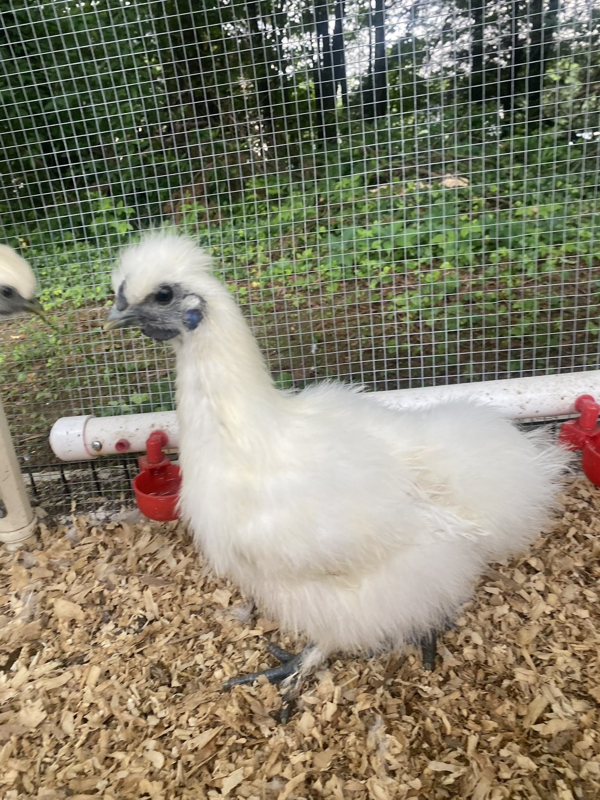
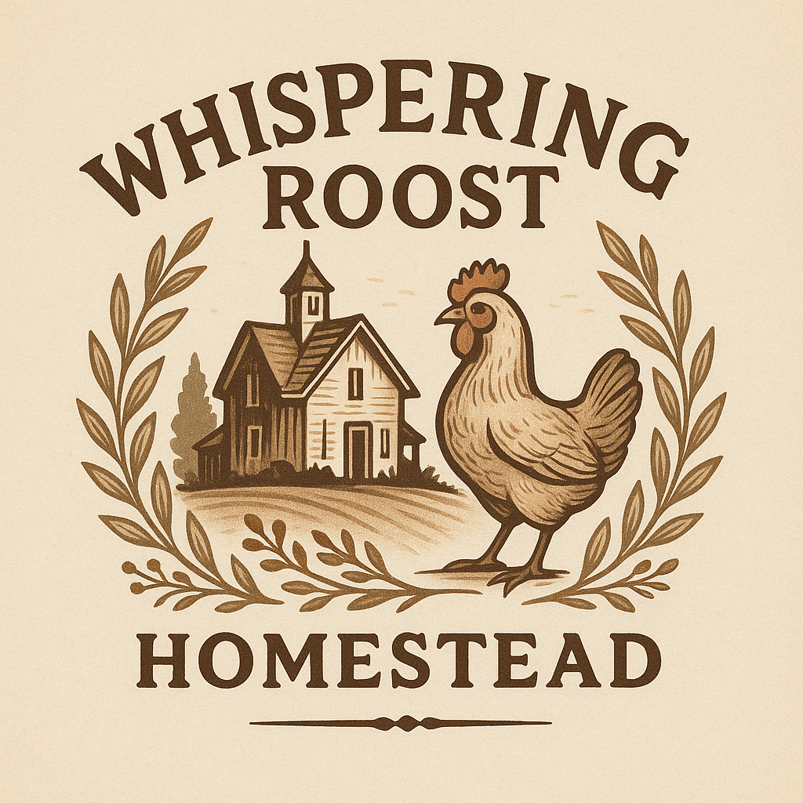

# Whispering Roost Homestead

  
*Whispering Roost Icon – displayed in header on the website.*

---

  
*Banner (constrained to 25% viewport height on the live site).*

---

## About Us

Welcome to Whispering Roost Homestead—our family-run chicken farm in rural North Carolina.  
We raise heritage-breed hens on open pasture, hand-collect fresh eggs, and care deeply about sustainable farming. Every rooster, hen, and chick is part of the family.

From offering day-old chicks to sharing tips on coop design, our goal is to keep things honest, simple, and community-focused.  
Come see how we whisper to our roosters and watch our hens roam free.

---

## Our Gallery

  
  
  
  
  
  
  

---

## Pricing & Packages

| Package            | Description                                            | Price          |
| ------------------ | ------------------------------------------------------ | -------------- |
| **Day-Old Chicks** | Heritage-breed, pasture-raised chicks ready to start your flock. | $5.00 / chick |
| **Pullets**        | Started hens (5–6 months), just about to lay.          | $25.00 / hen   |
| **Fresh Eggs**     | Farm-fresh brown or white eggs (carton of 12).         | $6.00 / dozen  |

---

## Get in Touch

  
*Whispering Roost Logo – displayed above “Get in Touch” on the site.*

Have questions? Want to schedule a farm visit or place a bulk order? We’d love to hear from you.

- **Email**: [info@whisperingroosthomestead.com](mailto:info@whisperingroosthomestead.com)  
- **Phone**: (555) 123-4567  

Follow us on social media for daily farm updates:  
[Facebook](#) · [Instagram](#) · [Pinterest](#)

---

[Home](#top)  
